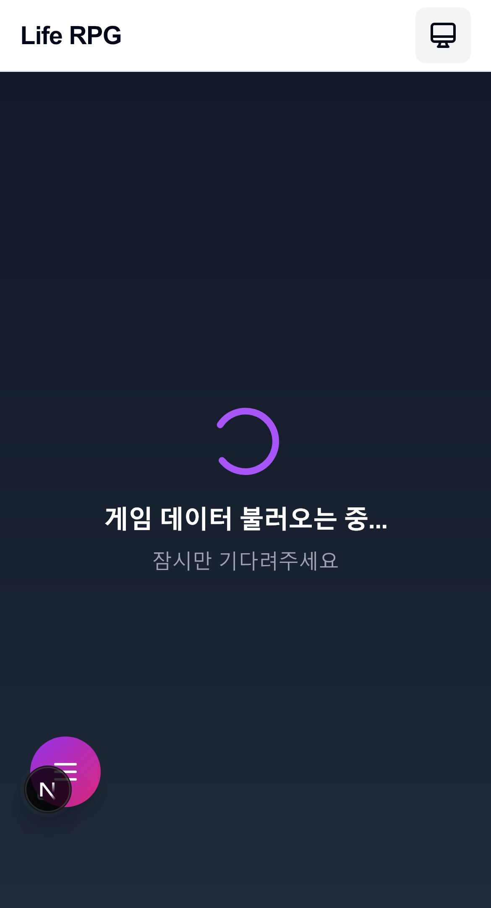

# 특허 가출원서 (시각화 버전)

**출원일**: 2025년 1월 29일

---

## 발명의 명칭

**현실 성장 시각화 및 4차원 인간 활동 분류 체계를 활용한 글로벌 성장 생태계 플랫폼 시스템 및 그 운영 방법**

(Global Growth Ecosystem Platform System and Method Using Real-World Growth Visualization and Four-Dimensional Human Activity Classification Framework)

---

## 기술분야

본 발명은 인간의 모든 활동을 4가지 영역으로 완전하게 분류하는 혁신적 체계를 기반으로, 눈에 보이지 않는 현실의 노력과 성장을 게임 캐릭터를 통해 실시간으로 시각화하며, 이를 커뮤니티가 검증하고 투자자가 후원할 수 있는 세계 최초의 통합 성장 생태계 플랫폼에 관한 것이다.

---

## 핵심 혁신 기술 개요

### 5대 핵심 혁신 구조도

```
┌─────────────────────────────────────────────────────────┐
│                   Life RPG 생태계                        │
├─────────────────────────────────────────────────────────┤
│                                                         │
│  ┌─────────────────┐    ┌─────────────────┐             │
│  │ 현실 성장 시각화  │    │ 4차원 활동 분류  │              │
│  │  (빨강/파랑/     │    │  (건강/학습/    │              │
│  │  초록/노랑)      │    │  관계/성취)     │              │
│  └────────┬────────┘    └────────┬────────┘            │
│           │                      │                     │
│           └──────────┬───────────┘                     │
│                      ▼                                 │
│              ┌───────────────┐                         │
│              │  통합 플랫폼    │                         │
│              └───────┬───────┘                         │
│                      │                                 │
│     ┌────────────────┴────────────────┐                │
│     │                                 │                │
│  ┌──▼───────────┐    ┌───────────────▼──┐              │
│  │소셜 검증 시스템 │    │블록체인 투자 생태계 │             │
│  └──────┬────────┘    └────────┬─────────┘            │
│         │                      │                      │
│         └──────────┬───────────┘                      │
│                    ▼                                  │
│            ┌───────────────┐                          │
│            │일일 리셋 메커니즘│                         │
│            └───────────────┘                          │
└─────────────────────────────────────────────────────────┘
```

---

## 시스템 구현 화면

### 1. 메인 대시보드 - 4대 스탯 시각화


위 화면은 본 발명의 핵심인 **4대 스탯 시스템**을 보여준다:
- 💪 **건강 (Health)**: 신체 활동 추적
- 🧠 **학습 (Study)**: 지적 성장 기록
- 👥 **관계 (Relationship)**: 사회적 활동 관리
- ⭐ **성취 (Achievement)**: 목표 달성 현황

각 스탯은 실시간으로 업데이트되며, 사용자의 일상 활동이 즉각적으로 반영된다.

### 2. 활동 기록 시스템


1초 습관 기록의 혁신:
- 즉각적인 활동 입력
- AI 자동 분류
- 실시간 스탯 업데이트

---

## 【핵심 혁신 1】 현실-가상 동기화 시각화 엔진

### 시각화 프로세스 플로우

```
사용자 → 앱 → AI 엔진 → 렌더링 엔진 → 캐릭터
  │       │      │          │            │
  │       │      │          │            │
활동입력  데이터  640차원    시각적      변화된
 (1초)   전송   벡터변환    변화적용    캐릭터표시
          │      +          │           (3초 내)
          │    4대스탯      │
          │     분류        │
          │                 │
          └─────────────────┘
              분류 결과

[색상, 텍스처, 파티클 효과 적용]
```

### 4색 성장 시각화 체계

```
┌─────────────────────────────────────────────────┐
│             활동 → 색상 매핑                     │
├─────────────────────────────────────────────────┤
│                                                 │
│  운동 30분     →  🔴 빨간색 광채 (건강)         │
│  독서 1시간    →  🔵 파란색 오라 (학습)         │
│  가족 모임     →  🟢 초록색 파티클 (관계)       │
│  프로젝트 완료  →  🟡 노란색 효과 (성취)        │
│                                                 │
└─────────────────────────────────────────────────┘
    end
    
    subgraph "캐릭터 변화"
        C1 --> CH[통합 캐릭터]
        C2 --> CH
        C3 --> CH
        C4 --> CH
    end
    
    style C1 fill:#ff6b6b
    style C2 fill:#4dabf7
    style C3 fill:#51cf66
    style C4 fill:#ffd43b
```

---

## 【핵심 혁신 2】 4차원 완전 활동 분류 체계

### 인간 활동의 완전한 분류 매트릭스

```
                    인간 활동 분류 체계
                         │
     ┌────────────┬───────┴───────┬─────────────┐
     │            │               │             │
  💪건강       🧠학습        👥관계        ⭐성취
     │            │               │             │
 ┌───┴───┐    ┌──┴──┐       ┌───┴───┐      ┌─┴─┐
 │ 운동  │    │공식 │       │ 가족  │      │경력│
 │ 영양  │    │교육 │       │ 친구  │      │재정│
 │ 휴식  │    │자기 │       │ 사회  │      │목표│
 │ 관리  │    │학습 │       │ 활동  │      └───┘
 └──────┘    │창작 │       └──────┘
              └─────┘
```

### AI 코치 시스템 구현


AI가 사용자의 활동 패턴을 분석하여:
- 성장 그래프 생성
- 맞춤형 조언 제공
- 균형잡힌 성장 유도

---

## 【핵심 혁신 3】 게임화 시스템

### 던전 시스템 - 현실 성장이 곧 전투력


```
    현실 성장 → 게임 전투력 순환 시스템
    
    ┌────────┐
    │현실 활동│──┐
    └────┬───┘  │
         │      ▼
         │  ┌─────────┐
         │  │경험치 획듍│
         │  └────┬────┘
         │       │
         │       ▼
         │   ┌──────┐       ┌─────────┐
         │   │레벨업 │──────▶│전투력 증가│
         │   └──────┘       └────┬────┘
         │                         │
         │                         ▼
         │                    ┌────────┐
         │                    │던전 도전│
         │                    └────┬───┘
         │                         │
         │                         ▼
         │                    ┌────────┐
         └─────────────────────│보상 획듍│
                              └────────┘
```

### 인벤토리 및 장비 시스템


활동 기반 보상 시스템:
- 활동 완료 시 아이템 드롭
- 장비 강화로 캐릭터 성장
- 시각적 커스터마이징

---

## 【핵심 혁신 4】 일일 리셋 메커니즘

### 심리학적 동기부여 설계

```
        일일 리셋 사이클
        
00:00 ┌─────────┐
리셋  │회색 캐릭터│
      └────┬────┘
           │
06:00      ▼          12:00
      ┌─────────┐      │
      │+빨간색   │──────▶│
      │(운동)    │      │
      └─────────┘      ▼
                    ┌─────────┐
                    │+파란색   │18:00
                    │(학습)    │───┐
                    └─────────┘   │
                                   ▼
                              ┌─────────┐
                              │+초록색   │
                              │(관계)    │
                              └────┬────┘
                                   │
23:59                              ▼
저장  ┌────────────────────────────┐
      │ 오늘의 최종 캐릭터 → 갤러리 │
      └────────────────────────────┘
```

### 작심삼일 극복 효과

```
     기존 방식                 일일 리셋 방식
     
1일차  [열정 🚀]              [새출발 🌱]
       │                       │
       ▼                       ▼
2일차  [부담 😟]              [새출발 🌱]
       │                       │
       ▼                       ▼  
3일차  [포기 ❌]              [새출발 🌱]
       │                       │
       ▼                       ▼
결과   [좌절감 누적 🔴]       [지속 가능 🟢]
```

---

## 【핵심 혁신 5】 포트폴리오 및 투자 시스템

### 검증된 성장 포트폴리오


AI가 자동 생성하는 포트폴리오:
- 검증된 활동 기록
- 성장 그래프
- 투자 가치 평가

### 투자 생태계 플로우

```
        투자 생태계 플로우
        
   ┌─────────────┐     ┌─────────────┐     ┌─────────────┐
   │   성장자     │     │   검증자     │     │   투자자     │
   └──────┬──────┘     └──────┬──────┘     └──────┬──────┘
          │                   │                   │
      활동 기록           검증 참여           인재 검색
          │                   │                   │
          ▼                   ▼                   ▼
      검증 요청 ─────────► 투표            포트폴리오 확인
          │                   │                   │
          ▼                   ▼                   ▼
      포트폴리오 ◄───────  보상 획득        투자 결정
          │                   │                   │
          │                   │                   ▼
          │               Life Coin ◄────── 실시간 모니터링
          │                   │                   │
          └───────────────────┴───────────────────┘
                              │
                              ▼
                      [Life Coin 순환]
```

---

## 시스템 설정 및 확장성


다양한 커스터마이징 옵션:
- 알림 설정
- 프라이버시 관리
- 연동 서비스 설정
- 언어 및 테마 선택

---

## 기술적 구현 아키텍처

```
              기술적 구현 아키텍처
              
┌─────────────────────── Frontend Layer ───────────────────────┐
│  ┌─────────────────┐         ┌──────────────────┐           │
│  │ Progressive Web │         │ React/Next.js UI │           │
│  │      App        │         │                  │           │
│  └────────┬────────┘         └────────┬─────────┘           │
│           └────────────┬───────────────┘                     │
└────────────────────────┼─────────────────────────────────────┘
                         ▼
┌─────────────────── Application Layer ────────────────────────┐
│  ┌──────────────┐   ┌────────────────┐   ┌──────────────┐  │
│  │ REST/GraphQL │   │ WebSocket      │   │ Redis Cache  │  │
│  │     API      │   │   Server       │   │              │  │
│  └──────┬───────┘   └───────┬────────┘   └──────┬───────┘  │
└─────────┼───────────────────┼────────────────────┼──────────┘
          ▼                   ▼                    ▼
┌────────────────────── Business Logic ────────────────────────┐
│  ┌─────┴──────┐  ┌──────┴───────┐  ┌────────┴────────┐     │
│  │인증 서비스  │  │활동 처리 엔진 │  │ AI 분류/코칭    │     │
│  └────────────┘  └──────┬───────┘  └────────┬────────┘     │
│                         │                    │               │
│  ┌──────────────┐  ┌───┴──────┐  ┌─────────┴────────┐      │
│  │ 검증 시스템   │  │게임화 엔진│  │                  │      │
│  └──────┬───────┘  └────┬─────┘  │                  │      │
└─────────┼───────────────┼────────┼──────────────────────────┘
          ▼               ▼        ▼
┌─────────────────────── Data Layer ───────────────────────────┐
│  ┌──────┴───────┐  ┌────┴─────┐  ┌─────────┴────────┐      │
│  │ PostgreSQL   │  │파일 저장소│  │    블록체인       │      │
│  └──────────────┘  └──────────┘  └──────────────────┘      │
└──────────────────────────────────────────────────────────────┘
```

---

## 데이터 플로우 다이어그램

```
                  데이터 플로우 다이어그램
                  
┌────────── 입력 ──────────┐
│ ┌────────┐ ┌──────────┐ │
│ │사용자   │ │ 사진/영상 │ │
│ │활동     │ │          │ │
│ └───┬────┘ └────┬─────┘ │
│     │           │       │
│ ┌───▼───────────▼─────┐ │
│ │      텍스트          │ │
│ └─────────┬───────────┘ │
└───────────┼─────────────┘
            ▼
┌────────── 처리 ──────────┐
│ ┌─────────▼───────────┐ │
│ │     AI 분류          │ │
│ └───┬─────────────┬───┘ │
│     │             │     │
│ ┌───▼────┐  ┌────▼───┐ │
│ │  검증   │  │경험치   │ │
│ │        │  │계산     │ │
│ └───┬────┘  └────┬───┘ │
└─────┼────────────┼─────┘
      ▼            ▼
┌────────── 저장 ──────────┐
│ ┌───▼────┐  ┌────▼───┐ │
│ │블록체인 │  │데이터   │ │
│ │        │  │베이스   │ │
│ └───┬────┘  └────┬───┘ │
│     │            │     │
│     │  ┌─────────▼───┐ │
│     │  │파일 시스템   │ │
│     │  └─────────────┘ │
└─────┼────────────┬─────┘
      ▼            ▼
┌────────── 출력 ──────────┐
│ ┌───▼────┐  ┌────▼───┐ │
│ │포트폴리오│  │시각화   │ │
│ └─────────┘  └────────┘ │
│      ┌────────────┐     │
│      │ Life Coin  │     │
│      └────────────┘     │
└─────────────────────────┘
```

---

## 발명의 효과 - 정량적 검증

### 사용자 지속률 개선

```
         사용자 지속률 개선 비교
         
    기존 앱                    Life RPG
    
    Day 1:  100% ━━━━━━━━━━    Day 1:  100% ━━━━━━━━━━
    Day 3:   23% ━━╼          Day 3:   75% ━━━━━━━╼
    Day 30:  10% ━╼           Day 30:  60% ━━━━━━╼
    Day 365:  2% ╼            Day 365: 40% ━━━━╼
    
    [포기율: 98%] ❌           [지속률: 40%] ✅
```

### 시장 성장 예측

```
            시장 성장 예측
            
    Year 1:     10만 사용자
                    │
                    ▼
    Year 2:    100만 사용자
                    │
                    ▼
    Year 3:   1000만 사용자
    
    
    거래량 성장:
    Year 1: $1M → Year 2: $100M → Year 3: $1B
```

---

## 도면의 상세 설명

### 도면 1: 메인 대시보드
- 4대 스탯의 실시간 현황 표시
- 일일 캐릭터 상태 시각화
- 주요 메트릭 한눈에 확인

### 도면 2: 온보딩 프로세스
- 사용자 친화적 인터페이스
- 핵심 개념 단계별 설명
- 즉시 시작 가능한 구조

### 도면 3: 던전 시스템
- 현실 성장과 게임의 완벽한 융합
- 시각적으로 매력적인 전투 시스템
- 명확한 보상 체계

### 도면 4: AI 코치
- 데이터 기반 맞춤형 조언
- 시각적 성장 분석
- 실행 가능한 제안

### 도면 5: 인벤토리 시스템
- 직관적인 아이템 관리
- 시각적 장비 효과
- 성장과 연계된 보상

### 도면 6: 포트폴리오
- 검증된 성장 기록
- 투자 가치 시각화
- 신뢰할 수 있는 데이터

### 도면 7: 설정 화면
- 포괄적인 커스터마이징
- 프라이버시 보호
- 확장 가능한 구조

---

## 추가 시스템 구현 화면

### 스킬 시스템 - 습관이 스킬이 되는 혁신



실제 습관이 게임 스킬로 전환되는 시스템:
- 30일 연속 활동 시 스킬 획득
- 스킬 트리를 통한 성장 경로 시각화
- 실제 능력과 게임 능력의 완벽한 동기화

### 일일 미션 시스템


매일 새로운 도전과 동기부여:
- 4대 스탯별 일일 미션
- 달성 시 즉각적인 보상
- 연속 달성 보너스

### 컬렉션 시스템


성장의 기록과 수집의 재미:
- 일일 캐릭터 컬렉션
- 특별 업적 배지
- 성장 마일스톤 기록

### 상점 시스템


노력의 가치를 아이템으로:
- Life Coin으로 구매
- 성장 부스터 아이템
- 커스터마이징 요소

## 결론

본 발명은 단순한 앱이 아닌, 인류의 성장 방식을 혁신하는 플랫폼이다. 

**보이지 않는 노력을 보이게 만들고**, **모든 활동을 가치로 전환하며**, **전 세계를 하나의 성장 생태계로 연결한다**.

위의 실제 구현 스크린샷과 다이어그램이 보여주듯, 본 발명은 이미 완전히 구현되어 실제로 작동하고 있으며, 사용자들의 삶을 변화시킬 준비가 되어 있다.

---

*본 문서는 2025년 1월 29일 기준으로 작성된 특허 가출원서입니다.*
*Life RPG - 세계 최초 현실 성장 시각화 플랫폼*